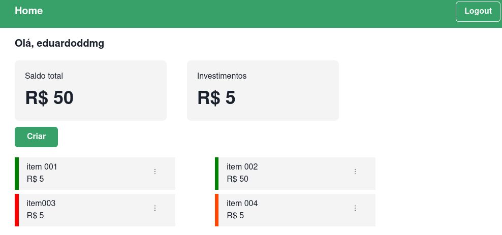

# Expenses tracker - gestor financeiro

## Introdução
Esse projeto é um gestor financeiro que consiste em o usuáiro conseguir controlar as suas finanças com maestria e eficiência, de modo a separar o seu dinheiro em 3 seções: entrada,saída e investimento.
## Tecnologias utilizadas
#### Back-End
* NodeJS
* ExpressJS
* JsonWebToken
* Bcrypt
* MongoDB
* Mongoose
* Dotenv
* Cors
#### Front-End
* ReactJS
* Context API
* Chakra UI
* Axios
* React Router Dom
* React Hook Form
## Estrutura
O código foi estruturado da seguinte maneira, temos o back-end e o front-end.
#### Back-end
No Back-end foi desenvolvida uma API RestFul do zero utilizando ExpressJs e mongoose. Para segurança dos dados utilizamos JWT (JsonWebToken), em que cada fez que o usuário deseja realiza alguma ação como adicionar,removar ou editar alguma transaçao, será verificado o JWT é valido e o JWT é enviado no momento do Login. A senha foi criptografada com BCrypt.
#### Front-end
Já no Front-end foi utilizado ReactJS, utilizamos para estilizaçao apenas Chakra-UI. Para manuseio de variáveis globais, foi utilizado ContextAPI em duas partes: Auth e Transaction. Uma coisa muito interessante que foi utilizada foi o ```Nested Routes``` que consiste em usar alguns componentes antes de ir de fato para as páginas. Desse modo, temos dois tipos: ```WithAuth``` e ```WithoutAuth```. Que só poderia acessar uma se o usuário estivesse logado ou deslogado (dependendo do caso). Para facilitar o gerenciamento de formulário, utilizei React Hook Form, utilizando requisitos de tamanho e valores de inputs, e também o parâmetro de expressoes regulares.
## Considerações finais
Obrigado por chegar até aqui, o projeto esta longe de estar perfeito. Porém, fiquei satisfeito com o resultado. Ainda faltar implementar algumas funções, mas em tese é isso. 
Até a proxima :)
